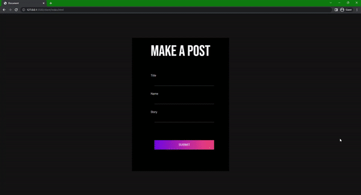

# Colorful Telegraph

## Gif of working application:

## 

# Colorful Telegraph

Colorful telegraph is an application where you can make posts which are saved onto a MongoDB database which you can revisit later - inspired by `telegra.ph`.

## Project Brief

#### Website should have the following functionality for users:

- Users should have a browser client allowing users to write a post with a title, a pseudonym and a body
- No login should be required to create a post or visit a post
- When a user hits 'publish', the post should be stored in a database and the client redirected to a show path
- The user should be able to access their post using that show path even after a server restart

## Installation & Usage

### Installation

- Clone or download the repo.
- Open terminal and navigate to `api` folder.
- Run `npm install` to install dependencies.
- Open terminal and navigate to `client` folder.
- Run `npm install` to install dependencies.

### Usage
- Open terminal and navigate to `api` folder.
- Run `npm run start` to launch server.
- Open terminal and navigate to `client` folder.
- Open a `live server` from `index.html` to launch the client-side.

